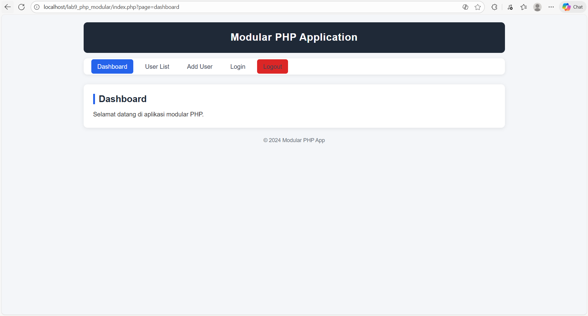
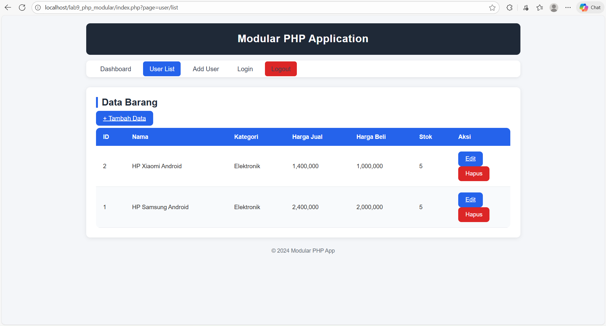
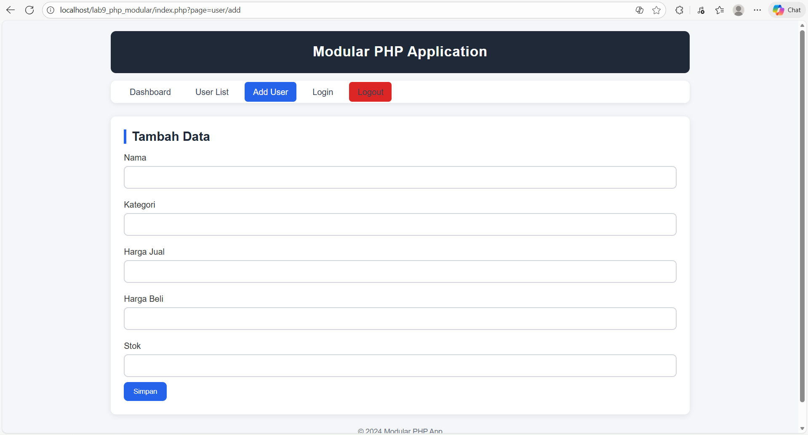
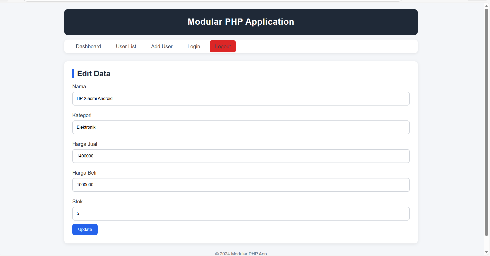
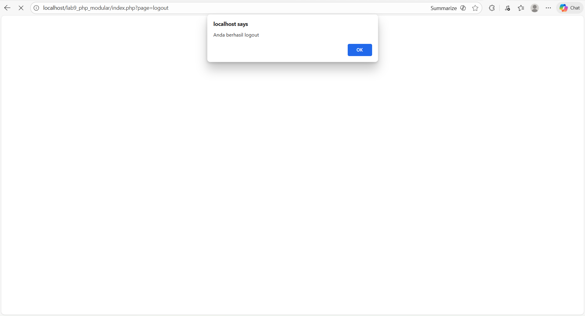

# **Praktikum 9 — Modularisasi PHP & Implementasi CRUD (lab9web)**

Repository ini berisi hasil pengerjaan **Praktikum 9 Pemrograman Web**, dengan fokus pada penerapan **modularisasi**, pembuatan **routing sederhana**, dan penataan ulang struktur sistem CRUD dari praktikum sebelumnya menjadi lebih rapi, modern, dan terorganisir.

Pada praktikum ini saya juga menambahkan fitur **Login** dan **Logout sederhana (tanpa session)** yang menggunakan mekanisme `alert()` dan `redirect`.

---

# 📁 **1. Struktur Direktori Project**

Struktur folder ini mengikuti standar modularisasi yang dianjurkan dalam modul praktikum:

```
lab9web/
│── index.php
│── config/
│   └── database.php
│── views/
│   ├── header.php
│   ├── footer.php
│   └── dashboard.php
│── modules/
│   ├── user/
│   │   ├── list.php
│   │   ├── add.php
│   │   ├── edit.php
│   │   └── delete.php
│   └── auth/
│       ├── login.php
│       └── logout.php
│── assets/
|   ├── css/
|    │   └── style.css
|    └── js/
|      └── app.js
|── images/

```

Struktur ini membuat project lebih modular, mudah dipahami, dan mudah dikembangkan.

---

# 🧩 **2. Penjelasan Setiap Folder**

## **📌 /config**

Berisi file konfigurasi inti, terutama:

### **`database.php`**

Tempat penyimpanan koneksi database MySQL yang digunakan oleh seluruh file di modul CRUD.

---

## **📌 /views**

Folder ini berisi file template yang dipakai di seluruh halaman:

* **header.php** → navbar, judul aplikasi, menu navigasi
* **footer.php** → footer halaman
* **dashboard.php** → halaman utama setelah login

Template ini memastikan UI tetap konsisten.

---

## **📌 /modules/user**

Berisi seluruh modul CRUD:

| File         | Fungsi                          |
| ------------ | ------------------------------- |
| `list.php`   | Menampilkan seluruh data barang |
| `add.php`    | Form tambah data                |
| `edit.php`   | Form edit data                  |
| `delete.php` | Menghapus data berdasarkan ID   |

Modul CRUD disusun rapi agar mudah dipelajari.

---

## **📌 /modules/auth**

Berisi fitur login dan logout:

### **`login.php`**

* Login sederhana
* Tidak memakai session
* Jika username/password benar, user diarahkan ke dashboard

### **`logout.php`**

Logout sederhana tanpa session:

```php
echo "<script>
    alert('Berhasil logout');
    window.location='index.php?page=login';
</script>";
```

Logout hanya menampilkan pesan dan mengembalikan user ke halaman login.

---

## **📌 /assets**

Berisi file pendukung tampilan:

* `css/style.css` → desain modern & responsif
* `js/app.js` → script ringan seperti konfirmasi delete

---

# 🔄 **3. Routing Menggunakan index.php**

Aplikasi menggunakan controller sederhana berbasis parameter `?page=`.

Contoh:

| URL                                | Tujuan           |
| ---------------------------------- | ---------------- |
| `index.php?page=dashboard`         | Dashboard        |
| `index.php?page=user/list`         | List data barang |
| `index.php?page=user/add`          | Tambah data      |
| `index.php?page=user/edit&id=xx`   | Edit data        |
| `index.php?page=user/delete&id=xx` | Hapus data       |
| `index.php?page=login`             | Halaman login    |
| `index.php?page=logout`            | Proses logout    |

Dengan routing seperti ini, seluruh alur website lebih ringan dan mudah dipahami.

---

# 🛢 **4. Struktur Database**

Menggunakan tabel:

### **`data_barang`**

| Kolom      | Tipe         |
| ---------- | ------------ |
| id_barang  | int (PK, AI) |
| nama       | varchar      |
| kategori   | varchar      |
| harga_jual | int          |
| harga_beli | int          |
| stok       | int          |

Database digunakan pada seluruh operasi CRUD.

---

# 🎨 **5. Tampilan  (Screenshot)**

Berikut area untuk screenshot (sebelum upload, ganti link gambarnya):

### **📸 Dashboard**



### **📸 Menu CRUD**



### **📸 Form Tambah Data**



### **📸 Form Edit Data**



### **📸 Logout Sederhana**



---

# 🧠 **6. Alur Kerja Aplikasi**

1. User membuka website → diarahkan ke dashboard
2. User memilih menu Login
3. Jika login benar → user kembali ke dashboard
4. User dapat membuka fitur CRUD:

   * Tambah data
   * Edit data
   * Hapus data
5. Jika user klik Logout:

   * Sistem menampilkan alert
   * User dikembalikan ke halaman login

Logout berjalan **tanpa session**, sehingga alurnya sederhana dan mudah dipahami.

---

# ✔️ **8. Kesimpulan**

Dalam praktikum ini saya belajar:

* Mengimplementasikan **modularisasi** pada project PHP
* Membuat struktur folder profesional
* Menggunakan routing berbasis `index.php`
* Membuat CRUD lengkap
* Membuat fitur login & logout sederhana
* Mendesain tampilan modern menggunakan CSS
* Memisahkan template agar lebih rapi

Struktur seperti ini sangat penting karena mendekati standar project web real-world.

---

**M. Ridho**
Praktikum 9 – Pemrograman Web
